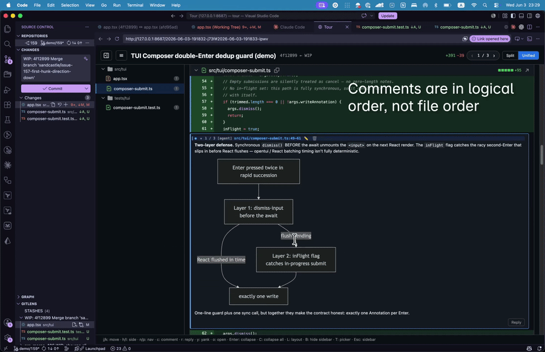

# tour

[](https://www.npmjs.com/package/tourdiff) [](./LICENSE)

Local code review at AI speed.

Your AI writes faster than you can review. Tour lets your AI leave a walkthrough on its diff as PR-style comments. Reply to the agent's comments, add your own, and jump to your editor in one keystroke.



[Watch the full demo →](./.github/assets/demo.mp4)

## Setup

### 1. Install the CLI

Homebrew (macOS, Linux):

```sh
brew install a9a4k/tap/tour
```

npm:

```sh
npm i -g tourdiff
```

Or any other Node package manager: `pnpm add -g tourdiff` · `bun add -g tourdiff` · `yarn global add tourdiff`.

Verify:

```sh
tour --version
```

### 2. Install the agent skill

Teach your AI agent (Claude Code, Codex, Cursor, Gemini CLI, OpenCode, …) how to leave Tours when you ask for a review:

```sh
npx skills add a9a4k/tour -g
```

Now asking your agent to *"review this branch"* or *"walk me through this diff"* produces a Tour — line-anchored comments, opened in your browser at a clickable URL — instead of a wall of chat. Works across the [skills.sh](https://skills.sh) ecosystem.

### 3. Seed the config

Run `tour init` to have Tour write a commented template to `~/.tour/config.toml` (or `$TOUR_HOME/config.toml`):

```sh
tour init
```

### 4. Configure your reply-agent and editor

Edit `~/.tour/config.toml` and set:

```toml
# Spawned when you press `s` on a comment — the AI that replies.
reply_agent = "claude --print --allowedTools Read,Grep,Glob,Bash --system-prompt {systemPrompt} {userPrompt}"

# Spawned when you press `o` on a line — your editor.
editor = "code -g {file}:{line}"        # VSCode
# editor = "cursor -g {file}:{line}"    # Cursor
# editor = "idea --line {line} {file}"  # JetBrains
# editor = "vim +{line} {file}"         # vim
```

`{systemPrompt}` / `{userPrompt}` are placeholders Tour fills in at spawn time. `{file}` and `{line}` come from the focused comment's anchor.

Verify:

```sh
tour config show
```

Should print both fields with `(from config)` as the source.

## Quickstart

```sh
cd your-repo
tour create --head HEAD              # tour the latest commit
tour                                  # open the tour (webapp on a desktop, TUI otherwise)
tour serve --open                     # force webapp + auto-open the browser
```

Tours live in `$TOUR_HOME/<repo-key>/<id>/` (default `~/.tour/`, out of your repo per ADR 0039 — coding agents with auto-commit can't sweep Tour internals into your commits). Each holds a `tour.toml` and an append-only `tour-events.jsonl` (event log per ADR 0036).

## For agents (without a global install)

In foreign repos where you don't want to install Tour globally — or for ad-hoc CLI use from a script — call it via `bunx` / `npx`:

```sh
bunx tourdiff create --head HEAD --json
bunx tourdiff comment <id> --file src/foo.ts --side additions --line 12 --body "..."
```

Or:

```sh
npx -y tourdiff create --head HEAD --json
```

## Commands

```
tour init                                             # seed ~/.tour/config.toml
tour config show                                      # show resolved config + sources

tour create --head <ref> [--base <ref>] [--title <s>] [--force] [--json]
tour comment <id> --file <f> --side additions|deletions --line <n[-m]> --body <b> [--json]
tour comment <id> --reply-to <comment-id> --body <b> [--json]        # reply on a thread
tour comment <id> --edit <comment-id> --body <b> [--as-human] [--json]  # edit (humans only)
tour comment <id> --delete <comment-id> [--json]                     # delete a comment
tour comment <id> --batch -                                          # read JSONL from stdin  (alias: annotate)
tour list [--all] [--status open|closed|all] [--json]
tour show <id> [--json]
tour pickup <id> [--json]                             # agent consumes human replies on this tour

tour                                                  # open the best surface for the env
tour tui [<id>] [--reply-agent <template>] [--editor <cmd>]
tour serve [--port 8687] [--open] [<id>] [--reply-agent <template>] [--editor <cmd>]

tour close <id>                                       # mark closed; keeps files
tour delete <id>                                      # remove the tour
tour prune --older-than <duration>                    # bulk-delete by age
```

`--head WIP` snapshots uncommitted work to a synthetic commit so the diff stays pinned. Full reference: `tour --help`.

## License

MIT — see [LICENSE](./LICENSE).
